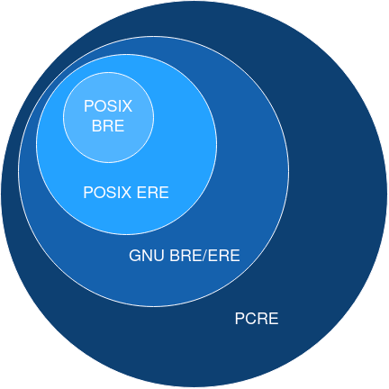

# Introduction à ``awk`` et aux Regex

## Awk

``awk`` est un puissant langage de programmation et un utilitaire en ligne de commande dans les systèmes Unix et Linux. Il est conçu pour la manipulation de texte et le traitement de données basées sur des fichiers texte ou des flux d'entrée. ``awk`` permet de rechercher des motifs, extraire et transformer des données.


Les fichiers de tests sont récupérables ici :

```sh
curl fichier.txt numbers.txt
```

Ils ont étés générés pour ``numbers.txt`` avec :
```sh
awk 'BEGIN { for (i = 1; i<= 10; i++) print int(100*rand()),  int(100*rand()), int(100*rand()) }' > numbers.txt
```

### Structure de Commande

La syntaxe de base de ``awk`` est la suivante :
```bash
awk 'pattern { action }' fichier
```

   - pattern : Un motif qui, s'il est vrai pour une ligne donnée, déclenche l'exécution de l'action.
   - action : Une série d'instructions entre {} qui sont exécutées lorsque le motif est trouvé.

### Variables par défaut

Awk fournit une liste de variables déjà initialisées, en voici une partie: 

   - ``NR`` : Numéro de ligne global (cumulé à travers tous les fichiers d'entrée (Number of Rows).
   - ``$0`` : La ligne entière actuelle.
   - ``$1``, ``$2``, ..., ``$n`` : Les n-ièmes champs d'une ligne, où le séparateur de champs par défaut est l'espace ou la tabulation.
   - ``FS`` : Le séparateur de champs (par défaut, espace ou tabulation).
   - ``OFS`` : Le séparateur de champs de sortie (par défaut, espace).
   - ``RS`` : Le séparateur d'enregistrements (par défaut, nouvelle ligne).
   - ``ORS`` : Le séparateur d'enregistrements de sortie (par défaut, nouvelle ligne).
   - ``FNR`` : Le numéro de ligne actuel dans le fichier d'entrée actuel (File Number of Rows).
   - ``NF`` : Le nombre de champs dans la ligne courante (Number of Fields).
   - ``FILENAME`` : Le nom du fichier d'entrée actuel.

On peut changer le délimiteur par défaut avec ``-F``, ``-F,`` utilisera ``,`` comme délimiteur au lieu de tab ou espace.

Awk permet aussi de déclarer ses propres variables dans les actions :

```sh
awk '{ n = 0; print n}' fichier.txt
```


### Imprimer des Colonnes Spécifiques

Pour imprimer le premier et le troisième champ de chaque ligne d'un fichier :

```bash
awk '{ print $1, $3 }' fichier.txt
```
Si aucun pattern n'est fourni alors ``awk`` matchera chaque ligne.

On peut fournir plusieurs commandes à awk en lui fournissant d'autres patterns et actions.

```bash
awk '{ print $1, $3 } { print $5 }' fichier.txt

# Ou bien en séparant sur plusieurs lignes :
awk '{ print $1, $3 } \
{ print $5 }' \
fichier.txt
```


### Filtrer par Motif

Pour afficher les lignes contenant le mot "ERROR" :

```bash
awk '/ERROR/ { print $0 }' fichier.txt
```

### Calculs et Opérations sur les Champs

Pour calculer la somme des valeurs des troisième et quatrième champs de chaque ligne:

```bash
awk '{ somme = $1 + $2; print somme }' numbers.txt
```

### Mots clés BEGIN et END 

``BEGIN { action }`` permet d'exécuter une action avant la lecture de la première ligne. De manière symétrique ``END { action }`` permet d'éxécuter une action après la lecture de la dernière ligne.

```sh
awk 'BEGIN { print "Début de traitement" } \
/ERROR/ { print $0 } \
END { print "Fin de traitement" }' fichier.txt
```

```bash
# Somme de la première colonne
awk 'BEGIN {n=0} {n += $1} END {print n}' numbers.txt
```

### Fonctions Intégrées

- **`length([string])`** : Renvoie la longueur d'une chaîne ou du champ courant.
- **`substr(string, start, length)`** : Extrait une sous-chaîne de `string` à partir de `start` sur `length` caractères.
- **`tolower(string)`** : Convertit la chaîne en minuscules.
- **`toupper(string)`** : Convertit la chaîne en majuscules.
- **`split(string, array, [separator])`** : Divise `string` en éléments dans `array`, séparés par `separator`.
- **`match(string, regex)`** : Renvoie l'indice de départ et la longueur de la correspondance de `regex` dans `string`.
- **`gsub(regex, replacement, [target])`** : Remplace toutes les occurrences de `regex` par `replacement` dans `target` (ou `$0` si omis).
- **`sub(regex, replacement, [target])`** : Remplace la première occurrence de `regex` par `replacement` dans `target`.
- **`srand([expr])`** : Initialise le générateur de nombres aléatoires avec `expr` ou l'heure actuelle.
- **`rand()`** : Renvoie un nombre aléatoire entre 0 et 1.


### Exercice
Attraper la ligne précédent un match
??? Note "Exemple de solution"
    ```sh
    echo 192.168.1.{1..254} | xargs -n 1 -P 0 ping -c 1 | awk '/1 reçus/ {print prev} {prev=$0}'
    ```

## Expression Régulières

Les expressions régulières (regex) sont un puissant outil de recherche et de manipulation de texte basé sur des motifs. Elles sont utilisées pour correspondre à des chaînes de caractères suivant des règles spécifiques.

Il y a plusieurs variantes de regex. Ces variantes diffèrent dans leurs syntaxes et possibilités et certains outils utilisent certaines variantes. Les variantes principales sont : 

- POSIX/GNU Basic Regular Expressions (``sed``, ``grep``)
- POSIX/GNU Extended Regular Expressions (``awk``, ``-E``)
- Perl-Compatible Regular Expressions (Perl, Python, PHP, Java)
 
POSIX a défini trois variantes, mais la plus ancienne, *simple regular expression* (SRE) est depréciée. Cependant les deux autres sont rétrocompatibles.

### POSIX Basic Regular Expressions (BRE)

Les BRE sont principalement utilisées par des outils Unix pour la rétrocompatibilité. Ainsi des outils tels que ``sed`` et ``grep`` les utilisent par défaut.

Un caractère normal ou une suite de caractères correspondent à eux même : 

- ``abcd`` : Correspond à "abcd".

Il y a plusieurs métacaractères ayant des effets particuliers: 

- ``.`` : Correspond à n'importe quel caractère sauf un saut de ligne.
- ``^`` : Début de la ligne.
- ``$`` : Fin de la ligne.
- ``*`` : Correspond à 0 ou plusieurs répétitions du caractère précédent. ``.*`` permet donc de matcher n'importe quel série de caractères.
- ``[]`` : Définit une classe de caractères. ``[abc]`` correspond à "a", "b" ou "c". On peut aussi matcher une plage de caractères. ``[a-z]`` correspond à tout les lettres de l'alphabet en minuscule.
- ``[^]`` : Définit une classe de caractères. ``[^abc]`` correspond à ce qui n'est pas "a", "b" ou "c".
- ``{n,m}`` : Correspond entre n et m répétitions de l'élément précédent. En BRE il faut noter ``\{n,m\}``.
- ``()``: Défini une sous-expression. Cette expression peut être rappelée plus tard avec ``\n``. En BRE il faut écrire ``\(\)``.
- ``\n`` : Permet de rappeler la n-ieme sous-expression. ``\(hello\) world \1`` matchera dans son entièreté "hello world hello".

### POSIX Extended Regular Expressions (ERE)

En ERE quasiment tout les fonctionnalités de BRE sont reprises, ``{}`` et ``()`` n'ont plus besoin d'être échapés avec des antislash ``\`` pour fonctionner. De plus ``\n`` n'est plus présent.

Il y a cependant trois nouveaux métacaractères :

- ``?`` : Correspond à 0 ou une seule fois l'élément précédent. ``ab?c`` correspondra donc avec ``ac`` ou ``abc`` par exemple.
- ``+`` : Correspond à minimum 1 fois l'élément précédent. ``ab+c`` correspondra avec ``abc`` ou encore ``abbbbc`` mais pas ``ac``.
- ``|`` : OU logique. ``abcd|efgh`` correspond à "abcd" ou "efgh".

Pour utiliser des ERE sur des outils tels que ``sed`` et ``grep`` il faut rajouter l'option ``-E`` :

```sh
echo hello world | grep -E "hello|bonjour|hola"
```

En plus de ces métacaractères, les BRE et les ERE supportent des classes de caractères :

- ``[:alnum:]`` : Caractères alphanumériques.
- ``[:alpha:]`` : Caractères alphabétiques.
- ``[:digit:]`` : Chiffres.
- ``[:lower:]`` ``[:upper:]`` : Caractères minucules et majuscules pour le second.
- ``[:space:]`` : Correspond à un espace vide, un " ", ou encore un tab, retour à la ligne...


Ces classes de caractères avec ``grep`` et ``sed`` doivent être encadrés de deux crochets : ``[[:lower:]]``. D'autres outils comme ``tr`` ne nécessitent qu'une seule paire de crochets.

### GNU vs POSIX

Il est important de noter que ``grep`` et ``sed`` sur la majorité des systèmes Linux sont en réalité ``GNU sed`` et ``GNU grep``, qui ne sont pas exactement les mêmes que ceux disponibles sur FreeBSD ou MacOS, et utilisent donc GNU BRE et GNU ERE au lieu de simplement la version POSIX.

GNU BRE et GNU ERE sont des extensions de POSIX BRE et POSIX ERE. En pratique, GNU BRE et GNU ERE fournissent les mêmes possibilités mais GNU BRE a besoin d'échapper les métacaractères seulement disponibles dans POSIX ERE.

Les opérateurs apportés par GNU BRE/ERE permettent de définir notamment les bords d'un mot :

- ``\b`` et ``\B`` : Permet de correspondre le début OU la fin d'un mot. Et pour ``\B`` de ne **pas** correspondre le début ou la fin d'un mot.
```sh
echo hello world | grep "hello\b" # => matchera
echo helloworld | grep "hello\b" # => ne matchera pas
```
- ``\>`` et ``\<``  : Permet de correspondre seulement le début d'un mot pour ``\<`` ou seulement la fin pour ``\>``.

... sur ``awk`` ``\b`` est reservé pour *backspace*, il faut donc utiliser ``\y`` à la place ...

```sh
echo hello world | awk '/hello\y/' # Renverra "hello world"
```

GNU ERE/BRE fourni aussi des raccourcis pour les classes de regex POSIX tels que ``\w`` pour les caractères alphanumériques (``\W`` pour la négation) ou encore ``\s`` pour les espaces blancs comme tabulation, espace, \r ... (``\S`` pour la négation).

### Perl-Compatible Regular Expressions (PCRE) 

Perl possède une variante d'expression régulière plus extensive que celles définies par POSIX. PCRE représente un moteur de regex basé initialement sur la syntaxe Perl et écrit en C qui permet d'implémenter cette variante de regex dans divers outils.
La syntaxe du langage Perl et du PCRE sont très proches mais pas exactement similaires. 


La force et flexibilité de cette syntaxe a poussé le PCRE a devenir un standard parmis les langages de programmation. Ainsi Python, Ruby, Java, .NET, JavaScript utilisent tous des près ou de loin la syntaxe PCRE. Certains langages tels que PHP ou R utilisent même directement le moteur PCRE.


La syntaxe PCRE récupère la syntaxe GNU ERE et y rajoute des fonctionnalités :


- ``\d`` : Correspond à un chiffre (0-9).
- ``\D`` : Correspond à un caractère non numérique.
- ``\w`` : Correspond à un caractère alphanumérique (lettres, chiffres, et underscore).
- ``\W`` : Correspond à un caractère non-alphanumérique.
- ``\s`` : Correspond à un caractère espace blanc (tab, espace, saut de ligne ...).
- ``\S`` : Correspond à un caractère non-espace blanc.

Et bien d'autres ...
[Spécification PCRE](https://www.pcre.org/original/doc/html/pcrepattern.html#SEC4)



### Exemples Pratiques

- ``hello`` : Correspond à la chaîne "hello".

- ``\d{3}`` : Correspond à exactement trois chiffres.

- ``\b[A-Za-z0-9._%+-]+@[A-Za-z0-9.-]+\.[A-Z|a-z]{2,}\b`` : Correspond à une adresse email.

#### Remplacement de Texte

En Python, vous pouvez utiliser des regex pour rechercher et remplacer des motifs dans une chaîne grâce au module ``re``.

```python
import re

texte = "Bonjour, je m'appelle Alice."
nouveau_texte = re.sub(r"Alice", "Bob", texte)
print(nouveau_texte)  # Bonjour, je m'appelle Bob.
```
